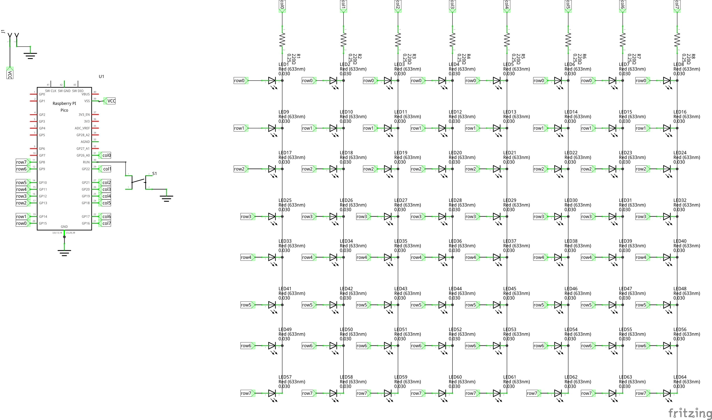
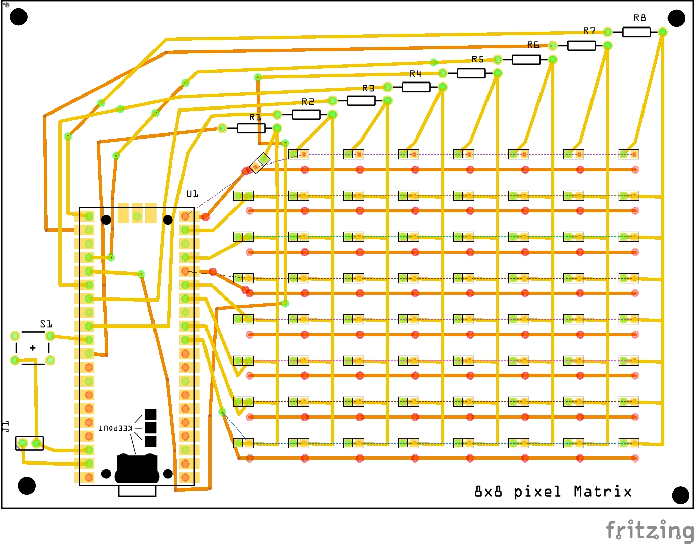

# Pico life

A traditionally multiplexed 8x8 led matrix driven by a Raspberry Pi Pico running Conway's game of Life.

## Hardware

All hardware files live inside the `hardware` directory. Schematic design was done using
[Fritzing](https://fritzing.org/).

Project is built around the [Raspberry Pi Pico
Microcontroller](https://www.raspberrypi.com/documentation/microcontrollers/raspberry-pi-pico.html#technical-specification)

## Software

All software files live inside the `software` directory. All software was written using the pico
[C/C++ SDK](https://www.raspberrypi.com/documentation/microcontrollers/c_sdk.html).

